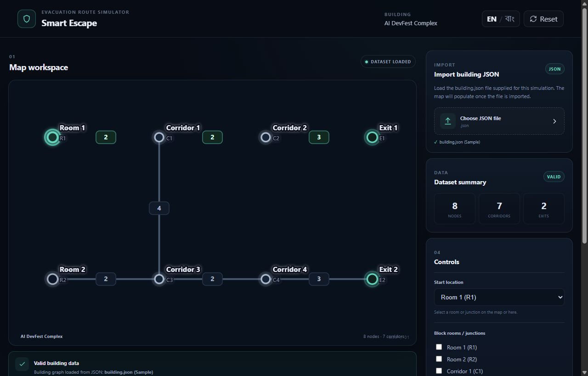
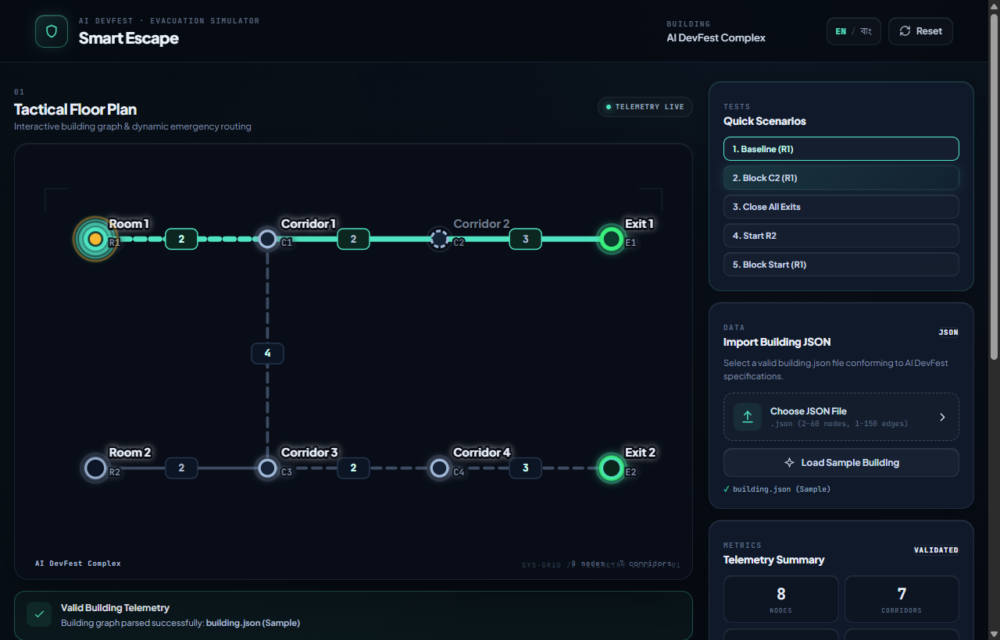

# SMART ESCAPE — Interactive Evacuation Route Simulator

[](LICENSE)
[](#running-instructions)
[](https://react.dev)
[](https://vitejs.dev)

> **AI DevFest 2026 — Practice Challenge / Mock Vibe Coding**  
> A browser-based evacuation routing simulator that models dynamic building hazards and calculates optimal escape routes to open exits in real time using Dijkstra's algorithm with strict tie-breaking rules.

---

## 👤 Participant Identity & Deliverables

- **Full Name:** Shreya Golder  
- **Registration Number:** `251-15-467`  
- **Final Commit ID:** `3152a74421b068c22789f257a070f3f33ceef12a` (`3152a74`)  
- **Repository URL:** [https://github.com/Shreyalien/SMART-ESCAPE_MOCK_VIBE_CODING](https://github.com/Shreyalien/SMART-ESCAPE_MOCK_VIBE_CODING)  
- **Live Deployment Link:** [https://shreyalien.github.io/SMART-ESCAPE_MOCK_VIBE_CODING/](https://shreyalien.github.io/SMART-ESCAPE_MOCK_VIBE_CODING/)  

---

## 📸 Screenshots

### 1. Baseline Route (`R1 → E1`, Cost: 7)


### 2. Rerouting After Blocking C2 (`R1 → E2`, Cost: 11)


---

## 🚀 Running Instructions

### Prerequisites
- **Node.js**: `v18+` or higher (tested on Node `v24.19.0`)
- **npm**: `v9+` or higher

### Local Development Setup
```bash
# 1. Clone repository
git clone https://github.com/Shreyalien/SMART-ESCAPE_MOCK_VIBE_CODING.git
cd SMART-ESCAPE_MOCK_VIBE_CODING

# 2. Install dependencies
npm install

# 3. Start local development server
npm run dev
```
Open your browser at `http://localhost:5173`.

### Production Build & Preview
```bash
# Build production bundle
npm run build

# Preview production build locally
npm run preview
```

### Running the Official Test Suite
We have included a dedicated automated test suite that validates the core routing engine against all 5 official rulebook scenarios:
```bash
node test_runner.js
```
Expected output:
```text
--- RUNNING OFFICIAL TEST SUITE ---
Test 1 (Baseline R1): { status: 'SUCCESS', path: 'R1 - C1 - C2 - E1', cost: 7, exit: 'E1' } -> PASS
Test 2 (Block C2): { status: 'SUCCESS', path: 'R1 - C1 - C3 - C4 - E2', cost: 11, exit: 'E2' } -> PASS
Test 3 (Close E1 and E2): { status: 'NO_ROUTE', error: 'No route available' } -> PASS
Test 4 (Select R2): { status: 'SUCCESS', path: 'R2 - C3 - C4 - E2', cost: 7, exit: 'E2' } -> PASS
Test 5 (Block start R1): { status: 'START_BLOCKED', error: 'Starting location blocked' } -> PASS
>>> ALL 5 OFFICIAL TEST CASES PASSED PERFECTLY! <<<
```

---

## 📋 Implemented Features (Mandatory Tasks)

| Feature | Description | Status |
| :--- | :--- | :---: |
| **Strict Input Validation** | Validates 2–60 nodes, 1–150 undirected edges, non-empty labels, case-sensitive IDs, self-loops rejection, duplicate node-pair checks, category consistency for initial hazards. | ✅ Completed |
| **Interactive Map Workspace** | SVG floor plan rendered from supplied `(x, y)` display coordinates, inverted Y scaling, distinct shapes for rooms, junctions, exits, and visible corridor costs. | ✅ Completed |
| **Dijkstra Shortest Path** | Computes the minimal edge-cost escape route from an unblocked room/junction to any accessible exit. | ✅ Completed |
| **Exact Tie-Breaking Rules** | 1. Minimum total cost<br>2. Lexicographically smallest Exit ID<br>3. Lexicographically smallest node sequence. | ✅ Completed |
| **Dynamic Simulated Hazards** | Users can block/unblock rooms, junctions, corridors, and exits by clicking elements on the map or using hazard pills. Route updates instantly. | ✅ Completed |
| **Failure Case Handling** | Clearly displays **"Starting location blocked"** when the start is obstructed, and **"No route available"** when no exit is reachable. | ✅ Completed |
| **Reset Capability** | Restores the building file's original `initial_state` without requiring re-import. | ✅ Completed |
| **Bilingual Support (EN / বাং)** | Full toggle between English and Bangla for all labels, statuses, buttons, legend items, and system error messages. | ✅ Completed |

---

## 🌟 Bonus & Extension Features

1. **Official Quick-Test Scenarios:** 1-click preset buttons for the 5 scenarios specified in Section 4.1 of the problem statement (`Baseline`, `Block C2`, `Close Exits`, `Start R2`, `Block Start`).
2. **Step-by-Step Route Walkthrough:** Interactive playback controls (`Play`, `Pause`, `Step`) with an animated visual marker advancing along the evacuation sequence node-by-node.
3. **High Contrast Accessibility Mode:** WCAG-compliant high-contrast theme toggle for emergency operations and accessibility.
4. **PNG Map Export:** Instant client-side download of the active floor plan, routes, and hazards as a high-resolution PNG image.
5. **Scenario JSON Export:** Save modified hazard scenarios and starting locations to an exportable JSON file.
6. **Pre-bundled Default Dataset:** Includes the official sample building layout so testers can evaluate the system immediately with zero file uploads required.

---

## 🤖 AI Tools & Most Useful Prompt

### Tools Used
- **AI Coding Assistant:** Google Antigravity (Powered by Gemini 3.8 Flash)

### Most Useful Prompt
```text
"Implement a robust Dijkstra routing algorithm for the Smart Escape simulator that adheres strictly to the AI DevFest specification:
1. Edge costs are summed to find the path cost (coordinates and corridor counts are never used for cost).
2. Exclude blocked nodes and their incident corridors, blocked corridors, and closed exits (both as destinations and as intermediate transit nodes).
3. Tie-breaking rules: On equal cost, pick the lexicographically smallest exit ID. If paths to that exit tie, pick the lexicographically smallest sequence of node IDs.
4. Correctly identify failure states: 'Starting location blocked' if start node is blocked, and 'No route available' if no open exit is reachable.
5. Provide a standalone test runner that asserts all 5 test scenarios from Section 4.1."
```

---

## 🐛 Known Issues & Limitations

- None identified. All validation limits, edge-cases (disconnected graphs, self-loops, duplicate edges, all exits closed, blocked starts) have been tested and verified.

---

## 📄 License

This project is licensed under the [MIT License](LICENSE).
